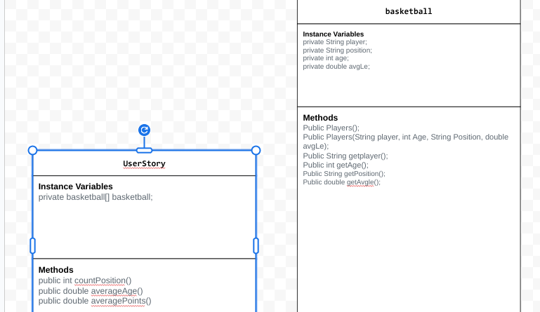

# Unit 3 - Data for Social Good Project

## Introduction

Software engineers develop programs to work with data and provide information to a user. Each user has different needs based on the information they are looking for from data. Your goal is to create a data analysis program for your user that stores and analyzes data to provide the information they need.

## Requirements

Use your knowledge of object-oriented programming, one-dimensional (1D) arrays, and algorithms to create your data analysis program:
- **Write a class** – Write a class to represent your user or business and store and analyze their data with no-argument and parameterized constructors.
- **Create at least two 1D arrays** – Create at least two 1D arrays to store the data that your user needs information about.
- **Write a method** – Write a method that finds or manipulates the elements in a 1D array to provide the information your user needs.
- **Implement a toString() method** – Write a toString() method that returns general information about the data (for example, number of values in the dataset).
- **Document your code** – Use comments to explain the purpose of the methods and code segments and note any preconditions and postconditions.

## User Story 

> As an basketball enthusiast,   
> I want to analyze the national basketball association,   
> so that I can learn about all the players and their stats throughout the playoffs.

## Dataset 

Dataset: https://www.kaggle.com/datasets/vivovinco/nba-player-stats
- **Player** (String) - name of players in the NBA playoffs
- **Position** (string) - position they play
- **age** (int) - age of the players
- **avgLe** (double) - average points during the playoffs for each player

## UML Diagram 

 

## Description 

My project uses object-oriented programming to look at NBA player data. I made a basketball class with instance variables and a constructor to create player objects. The UserStory class reads the data from files, puts it into an array, and has methods like countPosition, averageAge, and averagePoints to find useful stats. I also used the Scanner class so the user can type a number to pick a position and see how many players match it. The DataRunner class runs everything and shows the results which prints each player, their position, stats, and games played. It will also answer the questions and show average age for all players and average points for all. 